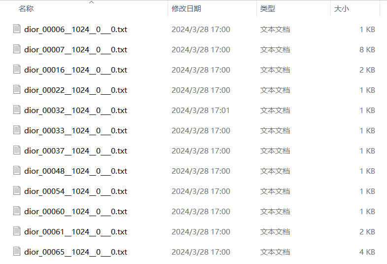
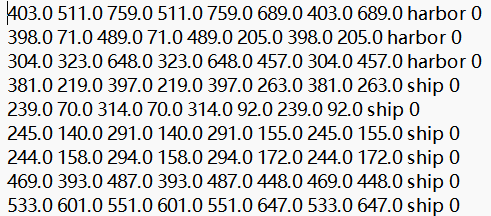
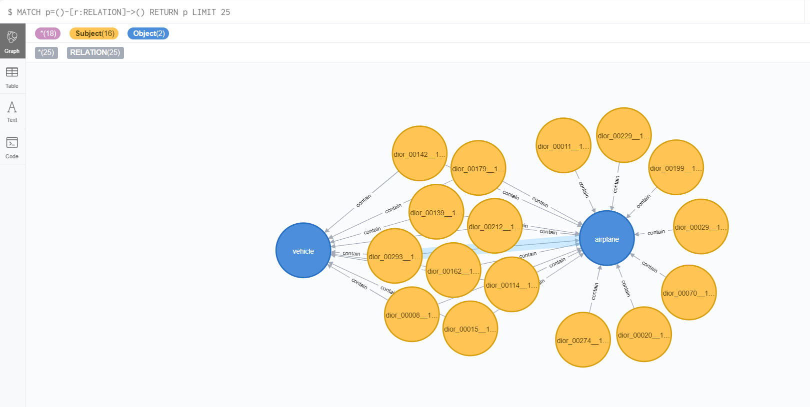

## 这是一个处理txt文件，使得txt文件可以转为csv文件以便导入neo4j数据库

## 详细代码在notebook里面可以看到

原始数据样本：

在**ship_label**文件下有诸如以下的txt文件：

每个txt文件内容为：

倒数第二列的英文单词就是我们想要的标签。

最终我们要构成三元组

* 首节点为：txt文件名
* 关系固定为：contain
* 尾节点为：txt文件中的英语单词（要求去重）

## 部分节点效果如下

